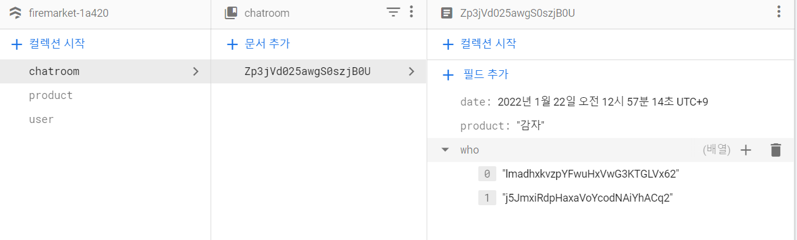

# [ Firebase ] 10. 채팅기능 2 - Firebase DB Query

상태: 작성 완료
생성 일시: 2022년 11월 19일 오후 11:09
중요도: ★★★
최종 편집 일시: 2022년 12월 6일 오전 9:20
태그: 🔥 Firebase

# 10. 채팅기능 2 - Firebase DB Query

파이어베이스에서 지원하는 DB 쿼리 작성 형식은 다음과 같다.

```jsx
db.collection('컬렉션이름').where('필드이름', '연산자', '값').get()
.then(()=>{
		// do something  
})
```

### where()의 파라미터에 대해

**필드이름** → JSON 형식으로 저장되는 문서에서 특정 키 값

```jsx
var data = {
	제목 : '감자',
	가격 : 5000,
	내용 : '맛있니? 예슬아?'
}
```

여기서 말하는 필드값은 **제목, 가격, 내용**이다.

[**연산자]**  ==, >=, <=, >, <, array-contains 등 내가 찾을 값에 대한 연산

참고 ) 파이어베이스 쿼리문에서 **필드에 대한 OR 연산자는 지원하지 않는다**고 한다.

```jsx
// 잘못된 OR 쿼리의 예시
.where(**['who','product']**, '==', 'uid') 
// 필드 파라미터에는 배열이 들어갈 수 없다.
// 즉, 필드 여러개에 대해 다중 쿼리가 불가능하다는 뜻이다.
```

OR 연산은 **in**, **array-contains** 연산자를 지원하는데 자세한 내용은 아래에서 후술한다.

### 내가 소속된 채팅방 목록을 가져오는 쿼리

현재 채팅방 데이터 속성값은 다음처럼 저장되어 있다.



who라는 **배열** 안에, 자신의 uid와 상대방의 uid가 저장되어 있다.
그렇다면 배열에 있는 값들 중에서 **내 uid를 포함하고 있는가**를 묻는 쿼리문은 어떻게 짤까?

```jsx
var currentUid = JSON.parse(localStorage.getItem('user')).uid; // 로컬 스토리지에 저장된 현재 유저의 uid를 가져온다.

db.collection('chatroom').where('who',**'array-contains'**, currentUid).get()
    .then((result)=>{
      result.forEach((item)=>{
        console.log(item.data());

        var template = `<li class="list-group-item">
                <h6>${item.data().product}</h6>
                <h6 class="text-small">${item.id}</h6>
              </li>`;
        $('.chat-list').append(template);   
    })
 })
```

여기서 연산자 값으로 사용한 **array-contains** 키워드는 배열에 사용할 수 있는 연산자이다.
**who필드의 배열에 내가 조건으로 입력한 uid를 포함한다면** 조건에 맞는 모든 데이터를 가져오라는 연산이 되겠다.

### 쿼리문 추가 설명 - A or B 연산

위에서 언급했듯, 파이어베이스 쿼리에서는 **필드에 대한 OR 연산자** ( || )를 지원하지 않는다.
그렇다면, 내가 찾을 데이터가 여러개일때 (이름이 윤예인**이거나** 황예슬인 데이터들) 는 어떡할까?

1. **값이 배열이 아닌 단일값 필드일 경우**

```jsx
.where('name', 'in', ['윤예인', '황예슬'])
```

1. **값이 배열인 필드일 경우**

```jsx
.where('name', 'array-contains-any' ['윤예인', '황예슬'])
```

1. **다른 필드도 쿼리하고 싶을 경우 (필드 OR 연산에 대해)**

```jsx
.where('name', 'array-contains-any' ['윤예인', '황예슬'])
.where('humen', 'array-contains-any' ['윤예인', '황예슬'])
// 아쉽지만, 필드당 쿼리문을 쳐주는 수밖에 없다.
```