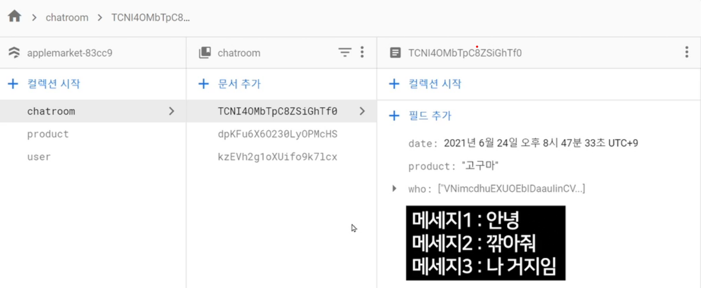

# [ Firebase ] 11. 채팅기능 3 - 메세지 DB 저장, 변동사항 실시간 반영

상태: 작성 완료
생성 일시: 2022년 11월 19일 오후 11:10
중요도: ★★☆
최종 편집 일시: 2022년 12월 6일 오전 9:20
태그: 🔥 Firebase

# 11. 채팅기능 3 - 메세지 DB 저장하기

당연한 개념이겠지만, 채팅방에서 메세지를 입력하면 해당 메세지는 그 채팅방 안에 저장되는 것이 국룰이다. 이를 파이어베이스 DB에서 어떻게 처리할까?



→ 메세지를 담아두는 **서브 Collection**을 만들어 해당 채팅방 문서안에 저장한다.

폴더 안의 폴더 개념으로, 해당 document안에 서브 collection을 생성할 수 있다.


messages라는 이름을 붙인 서브 컬렉션을 생성하고 문서 id는 자동으로 할당하여 임시 데이터 값을 만들어본다.


해당 채팅방 document에 massages라는 서브 컬렉션이 생성된 것을 확인할 수 있고,
그곳에 유저가 입력한 메세지들이 저장될 예정이다.

### 서브 컬렉션에 데이터를 저장하려면?

```jsx
db.collection('chatroom').doc('채팅방ID').collection('messages').add({})
// chatroom 컬렉션 안의 어떤 채팅방 document 안에 있는 서브 컬렉션인 massages 컬렉션 안에 데이터를 저장
```

.doc() .collection()은 연달아 쓸 수 있다. (타고타고 들어가는 방식이다. → 무슨 폴더안의 무슨 폴더)

이를 활용해, 메세지를 저장하는 코드를 작성해보자.

```jsx
$('#send').click(()=>{

      var msg = {
        content : $('#chat-input').val(), // 유저가 채팅란에 입력한 내용값
        date : new Date(), // 작성 날짜
        uid : currentUid // 해당 유저의 uid
      }

      db.collection('chatroom').doc(chatroomId).collection('messages').add(msg);

 })

 var chatroomId; // 채팅방 고유 ID를 저장할 전역 변수

  db.collection('chatroom').where('who','array-contains', currentUid).get()
  .then((result)=>{
      result.forEach((item)=>{
        console.log(item.data());

        var template = `<li class="list-group-item">
                <h6>${item.data().product}</h6>
                <h6 class="text-small">${item.id}</h6>
              </li>`;
        $('.chat-list').append(template);   

        $('.list-group-item').click(function(){ // 채팅방 목록중에 하나를 클릭하면, 해당 채팅방의 고유 ID값을 저장한다.
          chatroomId = $(this).children('.text-small').text();
        })

	   })
  })
```

여기까지 작성을 끝내고 메세지를 보내는데 **permission 에러**가 발생할 경우, 늘 그랬듯 파이어베이스 콘솔 규칙탭에서 권한부여 코드를 기입해준다.


### 결과)


테스트 해보면 성공적으로 해당 채팅방의 메세지 컬렉션에 데이터가 저장된 것을 확인할 수 있다.

마지막으로 채팅방에 저장된 메세지들을 쿼리로 읽어와 HTML 상에 보여주는 작업을 해보자.

```jsx
db.collection('chatroom').where('who','array-contains', currentUid).get()
    .then((result)=>{
      result.forEach((item)=>{
        console.log(item.data());

        var template = `<li class="list-group-item">
                <h6>${item.data().product}</h6>
                <h6 class="text-small">${item.id}</h6>
              </li>`;
        $('.chat-list').append(template);   

        $('.list-group-item').click(function(e){ // 채팅방 목록중에 하나를 클릭하면, 해당 채팅방의 고유 ID값을 저장한다.
          chatroomId = $(this).children('.text-small').text();

          e.stopImmediatePropagation(); // 이벤트 버블링을 막기 위한것. 이벤트 버블링은 구글한테 직접 물어서 공부하셈
					$('.chat-content').html(''); // 이전 채팅 내역을 모두 지우기

          // 해당 채팅방의 메세지 내역을 불러오기
          db.collection('chatroom').doc(chatroomId).collection('messages').get()
          .then((result)=>{
            result.forEach((item)=>{
              console.log(item.data());
              var template = `<li><span class="chat-box">${item.data().content}</span></li>`;
              $('.chat-content').append(template);
            })
        })

     })

   })
})
```

### 결과)


테스트 해보면 채팅방 목록에서 하나를 클릭하면 해당 채팅방의 채팅 내역을 읽어온다.
하지만 전송 버튼을 눌러서 메세지를 전송해도 실시간으로 업데이트되어 보이지 않고 **새로고침해야만 새로운 메세지가 보이는 문제**가 있다.

### 채팅을 실시간으로 반영하려면?

기존 코드에서 get().then() 부분을 수정해보자. → **onSnapshot()**

```jsx
// 해당 채팅방의 메세지 내역을 불러오기
  db.collection('chatroom').doc(chatroomId).collection('messages')**.onSnapshot**((result)=>{
		$('.chat-content').html(''); // 이전 채팅 내역을 모두 지우기
       result.forEach((item)=>{
	       console.log(item.data());
	        var template = `<li><span class="chat-box">${item.data().content}</span></li>`;
          $('.chat-content').append(template);
       })
  })
```

수정하면 DB에서 변화가 일어날때마다 해당 코드를 다시 실행하는 효과를 준다.

하지만 메세지의 순서는 상관없이 계속 위에만 메세지가 붙는데 firestore에서는 자동 정렬효과를 지원하지 않는다. 따라서, **orderby**문을 이용해 메세지 순서를 정렬해서 출력해보자.

```jsx
// 해당 채팅방의 메세지 내역을 불러오기
  db.collection('chatroom').doc(chatroomId).collection('messages')**.orderBy('date').onSnapshot**((result)=>{
		$('.chat-content').html(''); // 이전 채팅 내역을 모두 지우기
       result.forEach((item)=>{
	       console.log(item.data());
	        var template = `<li><span class="chat-box">${item.data().content}</span></li>`;
          $('.chat-content').append(template);
       })
  })
```

### 결과)


깔끔하게 정렬되어 출력되는것을 확인할 수 있다.

**알아서 해볼 응용사항들 :**

**(응용1) 지금은 메세지 보낼 때 개나소나 전송이 가능**

지금 메세지 게시물 저장하려는 사람의 uid가 메세지에 기록된 uid와 같은지 확인한다든지 그런 Firestore 규칙이 필요할듯

그거 말고도 chatroom 이런 컬렉션 규칙도 만들어보는걸 추천

**(응용2) 지금 회색 메세지 박스가 전부 왼쪽에 표기됨**

내가 보낸건 우측, 상대가 보낸건 좌측에 뜨도록 코드 어떻게 짜면 될까요?

메세지에 uid 기록되어있으니 그거가 내 uid와 같으면 우측으로 보내면 되지 않을까요.

**(응용3) 보낸시간, 보낸사람이름 이런거 표기는?**

사용자명, 보낸날짜 이런 것도 표기해주면 좋을 텐데

실은 그런것도 애초에 메세지 document에 다 저장해놓으면 편리할 수 있습니다.

아니면 uid를 가지고 그 uid 가진 사람의 이름이 누군지 user 컬렉션에서 조회하든가요.