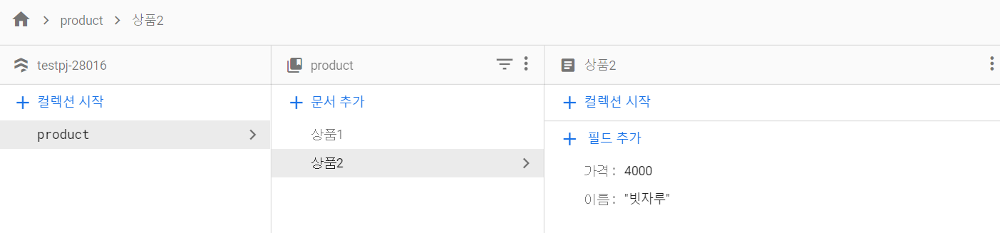

# [ Firebase ] 2. FireStoreDB R/W

상태: 작성 완료
생성 일시: 2022년 11월 19일 오후 10:52
중요도: ★★☆
최종 편집 일시: 2022년 12월 6일 오전 9:19
태그: 🔥 Firebase

# 2. FireStoreDB에서 데이터 불러오기, 저장하기 (R/W)

FireBase DataBase의 데이터 형식은 **Collection** 이라는 규칙을 따른다.



Collection → 데이터를 담는 폴더의 개념
위의 예시를 보면 알 수 있듯이 Collection 안에 Document(문서)가 있고 하나의 Document는 고유의 속성값을 Object(객체) 형식으로 가지고 있다.

```jsx
// object 형식
let 상품1 = {
	가격 : 2000,
	이름 : 면도기
}
```

### 데이터를 불러오기 (Read)

```jsx
const db = firebase.firestore();

db.collection('product').get()  //product라는 이름의 컬렉션 안에 저장된 데이터를 가져오라
.then((result)=>{ // 성공하면? result에 결과값이 담겨온다.
	console.log(result);
})
```

만약, 콘솔창에 **Permissions(권한) 에러**가 발생할 경우. FireBase 사이트에서 DB 읽기 권한을 설정하지 않아서 데이터에 접근할 수 없다.  FireStore 규칙 탭에서 수정하면 된다.

### 결과)


데이터 결과값은 가져왔으나, 우리가 원하는 상품에 대한 정보는 보이지 않는다. ( ex. 면도기, 3000 )

### Collection에 있는 모든 문서를 꺼내려면?

forEach문을 활용한다.

```jsx
const db = firebase.firestore();

db.collection('product').get()  //product라는 이름의 컬렉션 안에 저장된 데이터를 가져오라
.then((result)=>{ // 성공하면? result에 결과값이 담겨온다.
	result.forEach((doc)=>{
		console.log(doc);
	})
})
```

### 결과)


현재 2개의 문서가 DB에 저장되어 있기 때문에 데이터가 2개 출력되는 것을 확인할 수 있다.
다만 여전히 우리가 원하는 실제 데이터 값(이름, 가격)이 보이지 않고 sm이란 큰 틀로 감싸져 있다.
이는 문서안에 실제 데이터값 말고도 무수히 많은 데이터가 존재하기 때문에 발생한다.

따라서 내가 볼 데이터를 직접 정해서 출력하는 방식이 필요하다.
다음과 같이 코드를 수정해보자.

```jsx
const db = firebase.firestore();

db.collection('product').get()
.then((result)=>{ 
	result.forEach((doc)=>{
		console.log(doc.data()); // 현재 문서에 담겨있는 데이터를 출력한다.
	})
})
```

### doc.data()로 바꾼 결과)


이를 활용하여 **doc.data().제목** 형식으로 접근하면 각 상품의 제목만 출력하는 것도 가능하다.
가격 또한 마찬가지.

### 데이터를 저장하기 (Write)

A. 데이터 입력폼을 거치지 않고 <script>에서 다이렉트로 DB에 저장하기

A - **(1) 문서의 이름을 직접 지정하는 경우**

```jsx
const db = firebase.firestore();
db.collection('product').doc('상품3').set({ 제목 : '변기' });
```

### 결과)


지정한 ‘상품3’ 이름으로 저장된 문서를 확인할 수 있다.

A - **(2) 문서의 이름을 자동으로 설정하는 경우 (보통 자주쓰는 방식)**

```jsx
const db = firebase.firestore();
db.collection('product').add({ 제목 : '변기' });
```

### 결과)


자동으로 지정되는 고유 값 이름으로 저장된 문서를 확인할 수 있다.

B - **데이터 입력 폼을 거치는 경우**

HTML 파일에 데이터의 정보를 입력하는 폼을 하나 만든다.

```html
<div>
  <input type="text" id="title" placeholder="title">  // 상품명
  <textarea id="content"></textarea> // 상품설명내용
  <input type="text" id="price" placeholder="price"> // 가격
  <input type="file" id="image"> // 상품 사진
  <button id="send">상품 올리기</button>
</div>
```

상품에 대한 정보를 입력하고 올리기 버튼을 클릭했다면,

```jsx
const db = firebase.firestore();

$("send").click(()=>{ // JQuery문법. 상품 올리기 버튼을 클릭했을때

	var newData = {
		제목 : $('#title').val(), // JQuery문법. id가 title인 input태그에 입력된 값을 가져온다.
		가격 : $('#price').val(),
		내용 : $('#content').val()
	}

	db.collection('product').add(newData) // 위에서 작성한 새로운 데이터를 product 컬렉션에 저장한다.
	.then(()=>{
		console.log("데이터 저장 성공");
	})
	.catch(()=>{
		console.log("데이터 저장 실패");
	})

})
```

### 결과)


이름이 자동으로 설정되어 저장된 데이터가 확인된다.

---