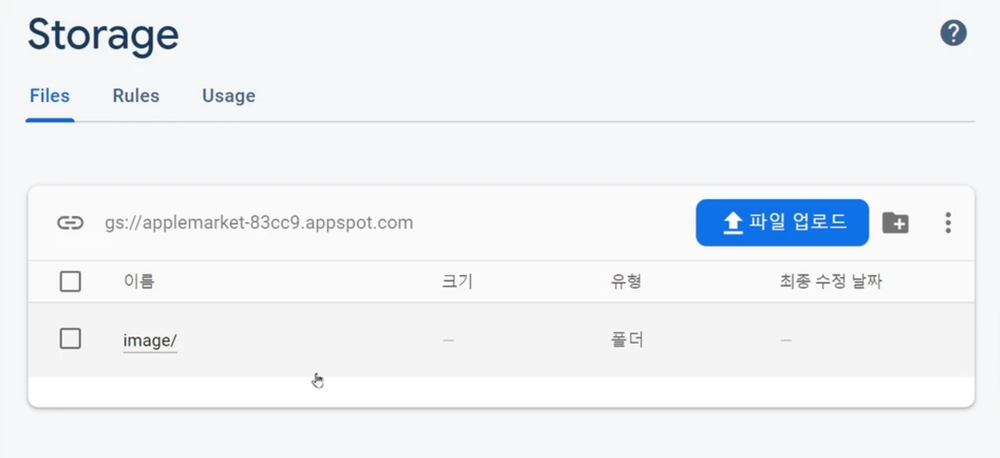

# [ Firebase ] 3. FireStore Storage에 이미지 업로드

상태: 작성 완료
생성 일시: 2022년 11월 19일 오후 10:57
중요도: ★★☆
최종 편집 일시: 2022년 12월 6일 오전 9:19
태그: 🔥 Firebase

# 3. FireStore Storage에 이미지 업로드하기

이미지를 DB에 바로 저장하지 않는것이 좋다.  이는 용량문제가 큰데, 보통 DB에는 해당 이미지의 저장 경로만을 저장하고 이미지 파일 자체는 서버 스토리지에 저장하는 식이다.

이전 파트인 **데이터를 저장하기(Write)** 데이터 입력폼을 참고하면서 하단 코드를 살펴보자

```jsx
const db = firebase.firestore();
const storage = firebase.storage(); // 파이어베이스 서버 스토리지

$("send").click(()=>{ 

	var file = document.querySelector('#image').files[0]; // id가 image인 태그에 올라와있는 파일을 가져온다. files 배열의 첫번째 값

	// 파일 저장경로를 설정한다.
	var storageRef = storage.ref();
	var path = storageRef.child('image/' + file.name); // 서버 스토리지에 저장시킬 경로 : image/현재 업로드된 파일 이름

	// 지정한 경로에 파일 업로드
	var upload = path.put(file) 

	// 이미지 업로드 성공 및 실패시 처리하는 코드
	upload.on( 'state_changed', // 업로드 작업중 상태의 변화가 생겼다면?
	    null, // 변화시 동작하는 함수(업로드 중 계속 돌아가는 함수)
	    (error) => { // 에러시 동작하는 함수
	      console.error('실패사유는', error);
	    }, 
	    () => { // 성공시 동작하는 함수
	      upload.snapshot.ref.getDownloadURL().then((url) => { // 파일 업로드 경로를 가져옴
	        console.log('업로드된 경로는', url); 

						var newData = {
							제목 : $('#title').val(), 
							가격 : $('#price').val(),
							내용 : $('#content').val(),
							이미지 : url
						}
					
						db.collection('product').add(newData) 
						.then(()=>{
							console.log("데이터 저장 성공");
						})
						.catch(()=>{
							console.log("데이터 저장 실패");
						})

	      });
	    }
	);

})
```

### 서버를 키고, HTML상의 폼에서 데이터 입력 결과)



아무것도 없는 공백 스토리지일 경우 지정한 경로대로 폴더가 새로 생성된다.


**image/파일이름** 으로 새롭게 저장된 것을 확인할 수 있다.