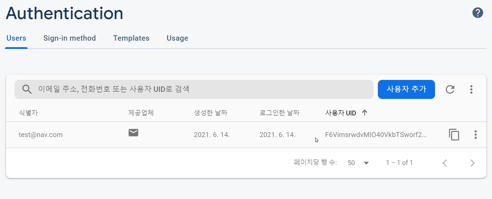

# [ Firebase ] 4. FireBase Authentication - 회원가입 만들기

상태: 작성 완료
생성 일시: 2022년 11월 19일 오후 10:59
중요도: ★★☆
최종 편집 일시: 2022년 12월 6일 오전 9:19
태그: 🔥 Firebase

# 4. FireBase Authentication - 회원가입 만들기

회원가입 입력폼을 하나 만들어보자.

```html
<div>
	 <input type="text" placeholder="name" id="name-new">
	 <input type="email" placeholder="email" id="email-new">
	 <input type="password" placeholder="pw" id="pw-new">
	 <input type="text" placeholder="nickname" id="nickname-new">
   <button type="submit" id="register">가입하기</button>
</div>
```

가입하기 버튼을 클릭했을 때 동작할 회원가입 코드를 작성한다.

```jsx
$('#register').click(function(){
  
  var email = $('#email-new').val();
  var pw = $('#pw-new').val();
	var nickname = $('#nickname-new').val();

  firebase.auth().createUserWithEmailAndPassword(email, pw)
	.then((result)=>{ // 회원가입이 성공했다면?
    console.log(result.user);
		result.user.updateProfile( {displayName : nickname} ); // 닉네임 설정 : 유저 객체 안의 displayname 속성값을 폼에 입력했던 닉네임 데이터로 바꾼다
  })

})
```

### 결과)



입력폼에 이메일과 pw를 입력하면 성공적으로 가입이 완료된 것을 알 수 있다.


console.log(result.user)에서 콘솔창에 uid를 확인할 수 있는데, 이는 유저의 PK개념이라고 볼수있다.