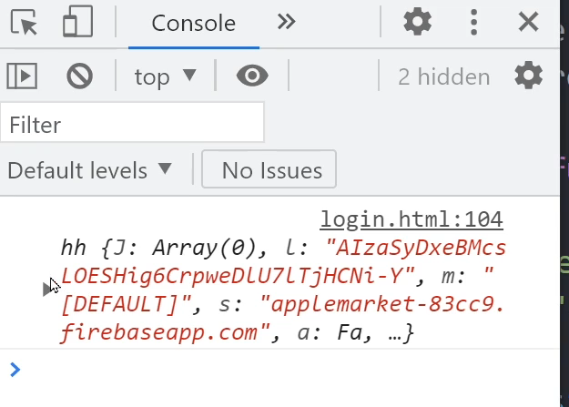

# [ Firebase ] 5. FireBase Authentication - 로그인 만들기

상태: 작성 완료
생성 일시: 2022년 11월 19일 오후 11:01
중요도: ★★☆
최종 편집 일시: 2022년 12월 6일 오전 9:19
태그: 🔥 Firebase

# 5. FireBase Authentication - 로그인 만들기

로그인을 위한 폼을 만들어보자.

```html
<div>
 <input type="email" placeholder="email" id="email">
 <input type="password" placeholder="pw" id="pw">
 <button type="submit" id="login">로그인하기</button>
</div>
```

로그인 처리 코드를 작성한다.

```jsx
$('#login').click(function(){
  
  var email = $('#email').val();
  var pw = $('#pw').val();

  firebase.auth().signInWithEmailAndPassword(email, pw).then((result)=>{
    console.log(result.user)
  })
})
```

### 결과)



로그인시 유저 정보가 담긴 객체가 콘솔창에 출력된다.
객체의 내부에는 이메일을 포함한 갖가지 정보들이 있다. (닉네임 등)

### 로그인한 유저만 글을 작성할 수 있도록 권한 수정하기

파이어베이스 콘솔의 규칙탭에서 다음과 같이 수정한다.


**request.auth != null**의 해석
→ 내가 로그인한 유저 객체를 요청했는데 객체값이 비어있다면 로그인 하지 않은 상태라고 간주하고 작성 권한을 주지 않을 것.

### 권한 종류

**read** → 열람

**write** → 작성

**create** → 새로운 document(문서) 생성

**delete** → 삭제

### 로그아웃 기능 만들기

간단한 버튼을 만들고 이에 대한 로그아웃 처리 코드를 작성한다.

```jsx
<button id="logout">로그아웃</button>
<script>
  $('#logout').click(function(){
    firebase.auth().signOut();
  })
</script>
```