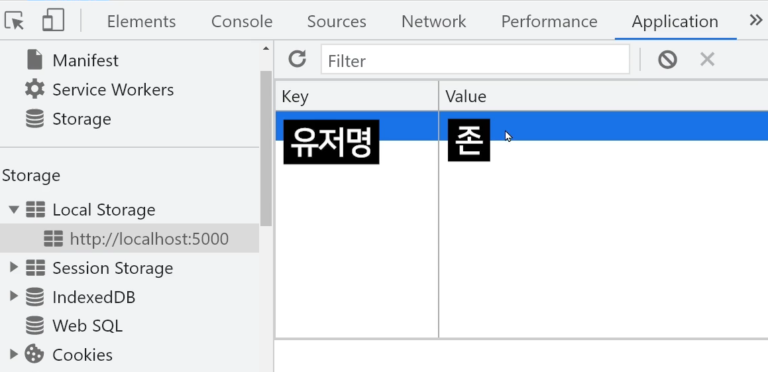

# [ Firebase ] 6. 로그인한 유저의 정보 가져오기

상태: 작성 완료
생성 일시: 2022년 11월 19일 오후 11:03
중요도: ★★☆
최종 편집 일시: 2022년 12월 6일 오전 9:19
태그: 🔥 Firebase

# 6. 로그인한 유저의 정보 가져오기

파이어베이스에서 지원하는 유저의 정보를 가져오는 코드는 다음과 같다.

```jsx
firebase.auth().onAuthStateChanged((user)=>{ // 현재 로그인 상태에 변화가 일어났다면? 유저객체를 가져온다.
  if (user) { // 유저객체가 존재한다면?
    console.log(user);
		$("#userName").text(user.displayName); // 유저 객체 안에 담긴 displayName 속성값을 가져와 유저의 이름을 표시
  }
})
```

유저가 로그인시 / 로그아웃시 / 페이지 새로고침시 동작하는 firebase.auth().onAuthStateChanged(()⇒{}) 함수는 페이지 내에 넣어두면 항상 로그인 되어있는지 체크할 수 있지만, **늦게 실행되는 함수**이다. (파이어베이스 서버에게 계속 요청하는 방식이기 때문)

따라서, 빠르게 유저의 정보를 가져오고 싶다면 한 번 가져온 유저 정보를 ***localStorage***에 저장해두고 계속 불러오는 방식이 바람직하다.



크롬 개발자도구에서 Application 탭 들어가면 localStorage를 확인할 수 있다.

이곳에 우리는 로컬 스토리지를 다루는 문법으로 데이터를 저장할 수 있다.

```jsx
localStorage.setItem('데이터이름', '데이터') // 저장
localStorage.getItem('데이터이름') // 가져오기
localStorage.removeItem('데이터이름') // 삭제
```

로컬 스토리지에는 **문자 데이터**만 저장가능하다. (이유 : JSON String만 저장하는 곳임)
이를 활용해 로컬스토리지에 유저 정보를 저장하는 코드를 작성해보자.

```jsx
firebase.auth().onAuthStateChanged((user)=>{
  if (user) {
    console.log(user)
    localStorage.setItem('user', JSON.stringify(user))
  }
})
```

### 결과)


JSON 문자열 형태의 유저 객체 정보가 로컬 스토리지에 저장된 것을 확인할 수 있다.

유저 정보를 저장하였다면, 로컬 스토리지에 있는 데이터를 꺼내보자.

```jsx
var userData = localStorage.getItem('user');
$('#userName').text(JSON.parse(userData.displayName)) // JSON문자열화 시켰던 데이터를 다시 object 자료형으로 변환

firebase.auth().onAuthStateChanged((user)=>{
  if (user) {
    console.log(user)
    localStorage.setItem('user', JSON.stringify(user))
  }
})
```

여기까지 따라왔다면 활용할 수 있는 부분으로는,

1. 로그아웃 버튼 누르면 localStorage에서 user 데이터 삭제.
2. onAuthStateChanged()의 경우 유저가 없을 때도 localStorage에 있던 user 데이터 삭제.