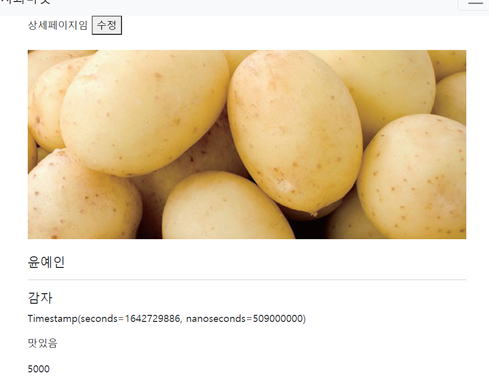

# [ Firebase ] 7. 수정 기능 만들기

상태: 작성 완료
생성 일시: 2022년 11월 19일 오후 11:04
중요도: ★☆☆
최종 편집 일시: 2022년 12월 6일 오전 9:20
태그: 🔥 Firebase

수정을 위한 폼을 만들어보자

```jsx
<div class="container mt-3">
    <input type="text" id="titleEdit" placeholder="title">
    <textarea id="contentEdit"></textarea>
    <input type="text" id="priceEdit" placeholder="price">
    <button id="send">수정하기</button>
</div>
```

### 기존 값을 그대로 수정창에 불러오기

```jsx
// 현재 코드는 라우터 기능을 사용하지 않은 쿼리스트링을 이용한 방식으로 페이지 이동 처리를 하였다.
var queryString = new URLSearchParams(window.location.search); // 현재 URL에 있는 쿼리스트링 속성값들을 가져온다.

db.collection('product').doc(queryString.get('id')).get() // 쿼리스트링에 넣어두었던 문서 고유코드를 넣어 해당 문서를 찾는다.
.then((result)=>{
   console.log(result.data());
   $('#titleEdit').val(result.data().제목);
   $('#contentEdit').val(result.data().내용);
   $('#priceEdit').val(result.data().가격);
})
```

### 결과)



상단의 수정버튼을 클릭해본다.


DB에 저장되어있던 기존값을 불러오는 것을 확인할 수 있다.

### 새로운 값을 입력해 수정하기

```jsx
$("#send").click(function(){ // 수정하기 버튼을 클릭했을때
    var newData = { // input에 입력되어있던 값을 가져와 데이터 객체를 만든다
        제목 : $('#titleEdit').val(),
        내용 : $('#contentEdit').val(),
        가격 : $('#priceEdit').val()
    }
    db.collection('product').doc(queryString.get('id')).update(newData); // 해당 상품을 수정한다.

 })
```

### 결과)


수정전의 데이터는 감자, 맛있음, 5000이다.


이를 감자, 맛있니? 예슬아?, 10000으로 수정한다.


상세페이지에서 해당 데이터로 수정된 것을 확인할 수 있다.

### 게시글 수정 권한 조정하기 (프론트엔드에서)

```jsx
$('#edit').click(()=>{
   var user = JSON.parse(localStorage.getItem('user'));

   if(localStorage.getItem('user') == null) { // 로그인하지 않았을 경우 -> 유저 객체가 비어있는 상태라면
      alert("로그인을 진행해주세요");
   } else if(user.displayName == $(".user").text()) { // 로그인하였고 작성자가 맞을 경우 -> 유저객체의 dispayName과 현재 게시글의 작성자 이름이 일치하면
     console.log(user.displayName);
     window.location.href = `/edit.html?id=${queryString.get("id")}`
   } else { // 로그인은 하였지만 글 작성자 본인이 아닐경우
      alert("권한이 없습니다.")
	 }

})
```

### 결과)

1. 로그인하지 않으면 수정 버튼을 클릭시 로그인을 진행해달라는 alert
2. 로그인은 하였지만 글을 작성한 회원 본인이 아닌 다른 계정일 경우 권한이 없다는 alert