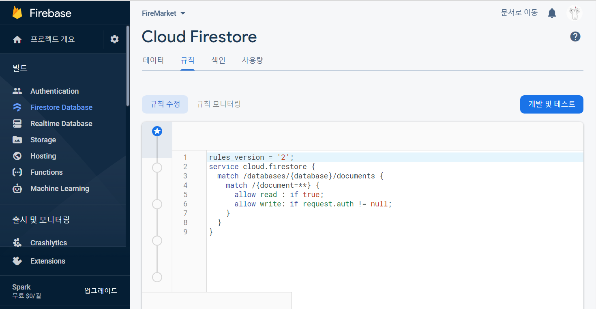

# [ Firebase ] 8. FireStore Rules 규칙 정리

상태: 작성 완료
생성 일시: 2022년 11월 19일 오후 11:07
중요도: ★★★
최종 편집 일시: 2022년 12월 6일 오전 9:20
태그: 🔥 Firebase

# 8. FireStore Rules 규칙 정리

이전 챕터(**7. 수정 기능 만들기**)에서 프론트엔드에서 권한 제어 코드를 작성해보았다면,
이번에는 백엔드에서의 권한 정의를 살펴보겠다.



이번 챕터는 파이어베이스 콘솔에서 실습한다.

파이어베이스 콘솔에서 기본적인 규칙 작성 형식은 다음과 같다.

```jsx
match **경로** {
	// 규칙 작성 가능
}
```

여기서 얘기하는 경로란, **/collection/document** 를 의미한다.
그렇다면 이를 활용해서 우리가 현재 DB에 저장해둔 **product** 컬렉션을 예로 삼아

```jsx
match /product/상품 {
	// 상품1 문서(Document)에 대한 규칙 작성 가능
}
```

이와 같은 방식으로 활용할 수 있다.

### collection안의 모든 document에 대해 규칙을 정의하고 싶다면?

```jsx
match /product/{docid} {
	// product 컬렉션 안의 모든 문서에 대한 규칙 작성 가능
}
```

{} 중괄호는 모든 document를 의미한다.
{작명=**} 으로 정의할 경우, 모든 하위 문서들까지 규칙을 정의하겠다는 의미이다.

### 권한 정리

읽기 **read**

쓰기 **write**

생성 **create**

수정 **update**

삭제 **delete**

```java
// if true는 제한없이 모두에게 부여한다는 의미
allow read : if true ;
allow write : if true ; // write는 create, update, delete를 한번에 모아놓은 개념
allow create : if true ;
allow update : if true ;
allow delete : if true ; 
```

활용 예시 1) 수정할 수 있는 권한을 어떻게 부여할 것인가?
→ 현재 유저의 uid와 게시물에 저장된 uid가 일치해야만 글을 수정할 수 있다.

```java
match /product/{docid} {
	allow update : request.auth.uid == resource.data.uid;
	// resource는 현재 내가 수정할 document를 의미한다.
	// 즉, resource.data는 현재 document 안의 모든 정보들을 읽을 수 있다는 의미가 된다. 
}
```

활용 예시 2)  쓰기 권한을 어떻게 부여할 것인가?
→ 현재 로그인 여부를 체크하고 로그인이 된 상태에서만 쓰기 권한을 부여한다.

```java
match /product/{docid} {
	allow write : if request.auth != null;  //로그인 상태를 요청하고 돌아온 유저 객체값이 null이 아닐 경우에 권한 부여
}
```

### 규칙 중복이 일어났을 경우?

