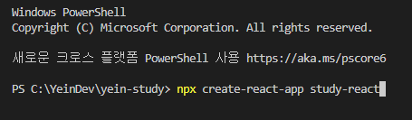
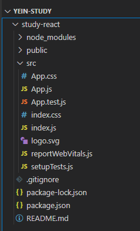

# [ React.js ] 1. React 개발환경 구성

상태: 작성 완료
생성 일시: 2022년 11월 26일 오후 3:00
중요도: ★★☆
최종 편집 일시: 2022년 12월 9일 오전 12:47
태그: JavaScript, React.js

<aside>
💡 Node.js를 기본적으로 설치했다는 전제하에 진행한다.
제발 최신버전 말고 LTS 설치하자. **( Current Version : v18.12.1 )**

</aside>

# 1️⃣ 새로운 React 프로젝트 생성



```jsx
// 프로젝트를 생성할 디렉터리에서
npx create-react-app [프로젝트명]
```

---

# 2️⃣ 프로젝트 소스 구조



- 생성된 프로젝트 소스 폴더 구조


 - 핵심이 되는 App.js의 구조 ( /src/App.js )
 .js 파일 내에서 HTML을 작성할 수 있는 구조 → JSX 문법이라고 한다.

---

# ✏️ 결론

> 명령어 단 한줄만으로 개발환경을 만들어주는 패키지 매니저는 신이다.