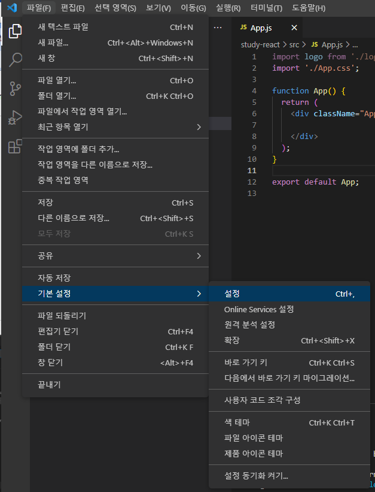

# [ React.js ] 2. JSX

상태: 작성 완료
생성 일시: 2022년 11월 26일 오후 3:34
중요도: ★★★
최종 편집 일시: 2022년 12월 9일 오전 12:54
태그: JavaScript, React.js

# 💡 React JSX에서 HTML 자동완성 적용

> JSX에서는 HTML snippet이 적용이 안되기 때문에 HTML 자동완성이 없다.
개발할 때 은근 킹받는 문제기 때문에 먼저 해결하고 시작하자.
> 



  1. 파일 → 기본 설정 → 설정


  2. 열린 설정창에서 저거 누르면 설정용 json 파일이 열린다.


  3. 위와 같이 설정 추가하자.


  4. 아주 잘된다.

---

# 1️⃣ JSX를 사용해야 하는 이유

<aside>
💡 **JSX란?**

> 대충 .js 파일 내부에서도 HTML 작성할 수 있는 편리한 문법
참고 포스트 : [https://cocoon1787.tistory.com/844](https://cocoon1787.tistory.com/844)
> 
</aside>

```jsx
// JSX 사용 안하고 HTML 엘리먼트 만들기
React.createElement('div', null, 'Hello, React');
```

```jsx
// JSX 사용하면?
<div></div>
```

  개발할 때 편하면 장땡이다. 더 설명이 필요한가?

---

# 2️⃣ HTML, JSX 비교

  **1. class 선언의 차이**

```html
<div class="test-class"></div>
```

```jsx
<div className="test-class"></div>
```

  **2. style 선언의 차이**

```html
<div style="color : black"></div>
```

```jsx
// HTML상에서는 font-size(케밥케이스), JSX에서는 fontSize(카멜케이스)
<div style={ {color : 'black'}, {fontSize: '20px'} }></div>
```

  **3. 데이터 바인딩은 {}**

```jsx
<div style={{color : 'black'}}>{변수명}</div>
```

  그 외 기본적으로 알아야 할 JSX 문법 몇가지 참고 포스트

  [https://goddaehee.tistory.com/296](https://goddaehee.tistory.com/296)

---

# ✏️ 결론

> 엘리먼트 하나 생성하자고 굳이 코드를 길게 칠 필요없다는게 최고의 장점 아닐까?