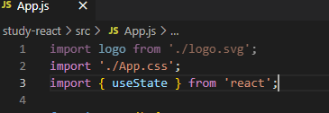

# [ React.js ] 3. State 활용, Click 이벤트

상태: 작성 완료
생성 일시: 2022년 11월 26일 오후 4:35
중요도: ★★★
최종 편집 일시: 2022년 12월 9일 오전 12:52
태그: JavaScript, React.js

# 1️⃣ state 선언과 사용

<aside>
💡 **state를 사용해야하는 이유**

> 일반 변수 선언의 경우 View HTML에 자동으로 반영되지 않는다.
  state의 경우 실시간 반영, HTML 자동 재렌더링이 되기 때문에 걍 안쓰면 손해임
> 
</aside>



 - 최상단에 import 선언

```jsx
import { useState } from 'react';
```

```jsx
// 변수 등록 useState();
let [a,b] = useState(['123', '456'[]](%5B%20React%20js%20%5D%200%20%E1%84%83%E1%85%B3%E1%86%AF%E1%84%8B%E1%85%A5%E1%84%80%E1%85%A1%E1%84%80%E1%85%B5%20%E1%84%8C%E1%85%A5%E1%86%AB,%20%E1%84%87%E1%85%A2%E1%84%8B%E1%85%AE%E1%86%B7%E1%84%8B%E1%85%B4%20%E1%84%8B%E1%85%B5%E1%84%8B%E1%85%B2%20%E1%84%92%E1%85%AA%E1%86%A8%E1%84%85%E1%85%B5%E1%86%B8%20f137b1d211c04c33b1b6cc420d811182.md));
```

---

# 2️⃣ state의 활용

  간단한 클릭 이벤트를 사용해보면서 state의 구조를 이해해보자.


```jsx
// 사용할 데이터의 첫번째 = 데이터 정의 (data)
// 사용할 데이터의 두번째 = 해당 데이터를 제어할 수 있는 state 핸들러 함수 (dataChange)
let [data, dataChange] = useState('안녕, 나는 초기 데이터');
```

```jsx
// <div className="App"></div> 내부
			{data}

      <button **onClick={()=>{** // 기본 클릭 이벤트, {}안에 함수를 작성한다.
        **dataChange(data = '안녕, 나는 변경된 데이터');** // 선언된 핸들러 함수에 변화 코드
      **}}**>
        변경!
      </button>
```


  - 변경 클릭전


  - 변경 클릭후

  

---

# 3️⃣ Array, Object의 state (feat. 데이터의 주소값)

<aside>
💡 **state 변경시 권장 사항**

> 항상 최초에 선언된 원본 데이터는 계속 보존하는 것이 좋다.
웬만하면 복사된 데이터를 새로 선언해서 사용하는 방식을 권장한다. 
**ex) let copyData = 원본데이터; → copyData 변경후 사용**
> 
</aside>


  Array, Object의 state를 다루는 데에서는 주의해야할 점이 있다.
  문자의 가나다순 정렬 기능을 작성해보면서 확인해보자.

```jsx
function App() {

	// 가나다 정렬 데이터 state 선언
  **let [data, dataSort] = useState(['가', '라', '마', '나', '사', '바', '아', '다']);**
  return (
    <div className="App">
    
      **{data}**

      **<button onClick={()=>{
        let dataCopy = data; // 기본 활용방식과 동일하게 작성했다.
        dataCopy.sort(); // 가나다 정렬 Array sort()

        data = dataSort(dataCopy);
      }}> 
        가나다순 정렬
      </button>**

    </div>
  );

}
```


  **- 아무리 버튼을 클릭해도 정렬 기능이 동작하지 않는다.**

  위의 코드가 실행되지 않는 이유는 2가지의 단계를 거친다.

  **1. state 변경 함수의 특징**

```jsx
let [data, **dataSort**] = useState(['가', '라', '마', '나', '사', '바', '아', '다']);
let dataCopy = data;
dataCopy.sort();

**// 기존 state = state변경함수(신규 state);**
**data = dataSort(dataCopy);**
```

  state 변경 함수의 특징은 기존 state를 변경하기 전, **기존 state와 신규로 들어온 state가 다른 데이터인지** 체크한다. *( ex.  data != dataCopy ?)*
  다른 데이터임이 확인되었을 경우에만 변경이 이루어지며, 만약 동일한 데이터임이 확인된다면 state 변경이 이루어지지 않는 방식을 띄고있다.
  이 부분에서 JAVA를 공부할때 흔히 배웠던 **데이터(객체)의 주소값** 개념이 큰 영향을 주게된다.

  **2. 데이터의 주소값**

```jsx
let [**data**, dataSort] = useState(['가', '라', '마', '나', '사', '바', '아', '다']);
let **dataCopy = data;**

let ****isSame = false;
**if(data == dataCopy) { // data와 dataCopy는 동일한 데이터인가?
	isSame = true;
};**

console.log(isSame);
**// 결과 = true**
```

  위의 코드 실행결과는 기존 state와 신규 state가 동일하다고 결과를 뱉는다. 왜일까?

  이 부분을 이해하기 위해서는 **CS 지식(컴퓨터 사이언스 → 메모리 구조)**이 다소 필요하다.  

```jsx
let [data, dataSort] = useState(['가', '라', '마', '나', '사', '바', '아', '다']);
// 지금부터 선언된 data는 **컴퓨터 메모리상에서 214번의 주소값**을 갖는다고 예를 들어보자.
```

```jsx
let dataCopy = data // 214번 주소값을 가진 data를 dataCopy에 저장한다.
// 새로 선언된 dataCopy에는 data 내부의 데이터가 아닌 **data의 주소값만을 저장**한다.
```

```jsx
let isSame = false;
if(data == dataCopy) { // 주소 214번과 주소 214번은 똑같냐?
   isSame = true;
}
console.log(isSame); // 똑같은게 당연하잖음 ㅋㅋ true
```

  위와 같은 단계를 거치기 때문에 state가 변경되기 위한 조건인 **“기존 state와 신규로 들어온 state가 다른 데이터인가?”** 를 만족할 수 없기 때문에 정상적으로 변경이 이루어지지 않는 것이다.

  그러면 어떻게 해결할까?
  Array 자료형과 Object 자료형은 **새로운 독립 객체 (새로운 주소값을 가진 데이터)**로 처리하자.

```jsx
let dataCopy = **[...data]**; // data의 내부 데이터는 그대로 복사하되, 새로운 주소값을 가진
												  // 배열을 새로 생성한다.
```


  - 아주 잘된다.

---

# ✏️ 결론

> 확실히 Vue.js가 React.js보다 쉽게 만들어져 있다는 것을 체감했다.