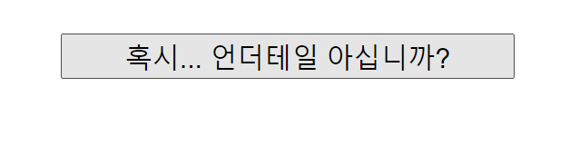

# [ React.js ] 4. Component

상태: 작성 완료
생성 일시: 2022년 12월 6일 오후 5:08
중요도: ★★★
최종 편집 일시: 2022년 12월 25일 오후 12:33
태그: JavaScript, React.js

# 1️⃣ return() 내부 HTML 작성 주의사항

  return() 내부의 HTML은 반드시 하나의 엘리먼트로 끝나야 한다.

```jsx
// 잘못된 예
return(
  <div></div>
  <div></div>
)

// 올바른 예
return(
  <div>
    <div></div>
    <div></div>
  </div>
)

// 올바른 예의 다른 형태 -> fragment 문법( <></> )으로도 가능하다. 
return(
  <>
    <div></div>
    <div></div>
  </>
)
```

---

# 2️⃣ Component 생성 & 활용

<aside>
💡 **Component ?**

> 모든 HTML 태그를 App(){}의 return에 작성할 수는 있겠지만 효율성이 극도로 떨어진다. 각 기능에 맞는 HTML을 적절히 나눠서 상황에 따라 배치 및 관리하는 방법이 필요한데, 이를 Component로 처리할 수 있다.
> 
</aside>

  간단한 Modal을 구현하면서 Component 구조를 이해해보자.


```jsx
// 새로운 Component를 생성하는 방법
// 많은 HTML 태그를 묶어서 하나의 함수 단위로 관리한다고 이해하면 편리함.
function Sans(){
  return(
    <div className="sans">
			<h2>WA!</h2>
			<p>샌즈!</p>
		</div>
  );
}
```

```jsx
// arrow function으로도 Component를 생성할 수 있다.
let Sans = () => { // 여기서 const쓸지는 let 쓸지는 상황에 맞춰 판단해 사용하자.
  return (
			// ~ 뭐시기 태그
	) 
}
```

  기본 구조가 App(){}과 동일하므로 **App(){} 또한 하나의 Component**라는 것을 이해할 수 있다.
  그렇기 때문에 일반적으로 Component 내부에서는 또 다른 Component를 삽입만 할 뿐, 새롭게 생성하지는 않는다.

 

```jsx
// 생성한 Component를 App(){} 내부에 삽입해 사용하기
function App (){
  return (
    <div>
      <Sans></Sans> // 작명한 이름 그대로 하나의 태그와 같이 작성한다.
			<Sans/> // 위의 축약 표기법
    </div>
  )
}

// 컴포넌트 작명시 반드시 첫글자를 대문자로 하는 것이 원칙이다.
// 파스칼 케이스 모르면 바보
function Sans() { 
	return (
		<div className="sans">
			<h2>WA!</h2>
			<p>샌즈!</p>
		</div>
	)
}
```

  새로운 컴포넌트를 생성했고, state까지 덧붙인다면 조건에 따라 창을 열리고 닫히게 할 수 있는 **동적인 모달**을 만들 수 있다.

```jsx
// 모달에 대한 state를 작성해보자.
// 열림, 닫힘에 대한 상태값과 해당 상태값을 수정할 수 있는 state 제어 함수를 작명했다.
let [**modalOn, setModal**] = useState(false);
// 보통 state 제어 함수를 작명할 시 set을 붙이는게 관습이라고 하니 알아서들 외워두자...
```

  이제 조건에 따라 모달을 열리고 닫히게 하는 코드를 작성할 것인데, 유의사항이 있다.
  JSX에서는 일반적인 **if/else 문법**을 사용할 수 없다. 근데 신기하게도 삼항연산자는 된다. 그러면 되는 방법 쓰는게 맞으니까 **삼항연산자**를 활용해 작성한다.
  삼항연산자를 사용할때는 **중괄호{}**로 감싸주자.

```jsx
function App() {
  **let [doYouKnowUndertale, setUndertale] = useState('혹시... 언더테일 아십니까?');
  let [sansOn, setSans] = useState(false);**
  return (
    <div className="App">

      **<button className='i-know' onClick={()=>{** // 모달 트리거 버튼을 작성
        **if(sansOn == true) {** // 만약 이미 열려있다면 닫게 해주셈.
          **setSans(false)
          setUndertale('혹시... 언더테일 아십니까?')
        } else {
          setSans(true)
          setUndertale('언더테일 아시는구나!')
        }
		  }}>
			  {doYouKnowUndertale}
		  </button>

      <div className="sans">
        {
          sansOn == true ? <Sans/> : null** // true면 보여주고 아님 말고
        **}
      </div>**

    </div>
  );

}

function Sans(){
  return(
    <div className="sans">
			<h2>WA!</h2>
			<p>샌즈!</p>
		</div>
  );
}

// 적용한 CSS (본 가이드 기준 src/App.css 에서 작성)
.i-know {
  margin-top: 50px;
  width: 500px;
  height: 50px;
  font-size: 30px;
  cursor:pointer;
}
.sans {
  font-style: italic;
  font-size: 70px;
}
```



  - 클릭해보자


  - 와! 샌즈!

---

# ✏️ 결론

> 와! 컴포넌트!
와! 삼항연산자!
와! 샌즈!