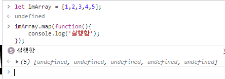

# [ React.js ] 5. JSX의 반복문 활용

상태: 작성 완료
생성 일시: 2022년 12월 7일 오후 2:49
중요도: ★★★
최종 편집 일시: 2022년 12월 12일 오전 11:34
태그: JavaScript, React.js

# 1️⃣ 왜 갑자기 반복문?

  프론트엔드상에서 게시판의 많은 게시물들을 불러오는 코드를 짜는 상황을 가정해 생각해보자.

  앞으로 언제, 어떻게 새로운 게시물 데이터가 추가될지 모르는 상황에서 **해당 게시물의 갯수만큼 똑같은 틀의 코드를 수십개 복사 붙여넣기 한 다음에 그대로 데이터 바인딩**을 하는건 비효율의 극치라고 말할 수 있다.

```jsx
function App() {
	return (
    <div className="App">
			**<div>
				<h2>첫번째 글 제목<h2>
				<p>내용</p>
			</div>

			<div>
				<h2>두번째 글 제목<h2>
				<p>내용</p>
			</div>

			<div>
				<h2>세번째 글 제목<h2>
				<p>내용</p>
			</div>
			...** // 글이 수만개면 언제 다 작성함?
****
    </div>
  );
}
```

  그렇기에 코드의 가독성 및 효율성을 위해서 for와 같은 **반복문**을 사용해 똑같은 틀을 그대로 찍어내기 하되, 내용 데이터를 변수로 할당해 깔끔하게 관리하는 것이다.
  모르면 안되는 프론트엔드 개발자의 기본 소양이다.


  이를 JSX에서는 어떻게 처리할 수 있을까?
  그냥 똑같이 for문을 사용하면 된다고 간단하게 말할 수도 있다. 하지만 사실 **JSX 내부에서는 for문을 못쓴다.**

  이게 무슨 소리인가 싶지만, 정확히는 JSX의 중괄호{} 안에서 for문을 인식하지 못하기 때문에 사용할 수 없다는 얘기지 반복문 자체가 안된다는 게 아니다. 항상 방법은 여러가지가 있다.

---

# 2️⃣ Array.map()

  자바스크립트의 배열 내장함수 중에는 JSX에서 for문의 대체품으로 활용 가능한 함수가 존재한다. 바로 **map()** 함수이다.

```jsx
let imArray = [1,2,3,4,5]; // 배열을 생성하고
// .map을 작성하면 해당 배열의 데이터 개수 만큼 callback 함수를 반복 실행한다.
imArray.map(function(){ // function 생략 가능 -> ()=>{}
	console.log('실행함');
});
```



  - 정확히 다섯번 찍히는걸 확인할 수 있다.


  - callback 함수의 파라미터(val)에는 각 횟수마다 해당 배열 자리의 데이터를 가져온다.

  이제 map() 함수를 JSX에서 활용해보자.

```jsx
function App() {
  let wa = ['와!', '샌즈!', '겁.나.어.렵.습.니.다'];
  return (
    <div className="App">

			{ 
        wa.map((sans, i)=>{
          return (
            <>
              <div>[ {i}번째 ]</div>
							<p>{sans}</p>
            </>
          );
        }) 
      }
      
    </div>
  );
}
```


  - 샌즈가 어렵긴 함.

---

# ✏️ 결론

> Array.map()을 애용하도록 합시다.