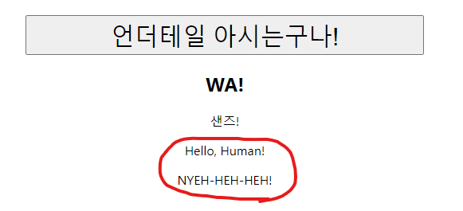

# [ React.js ] 6. props

상태: 작성 완료
생성 일시: 2022년 12월 8일 오후 10:45
중요도: ★★★
최종 편집 일시: 2022년 12월 21일 오전 9:48
태그: JavaScript, React.js

# 🤝 state를 공유하고 싶은 순간, props

  Vue.js를 어느정도 경험해 본 사람은 **props**의 개념에 대해 바로 감이 올 것이다.

  props는 **컴포넌트 간 state를 공유하고 싶을 때** 사용하는 문법이라고 할 수 있는데,
  이를 귀찮다고 사용하지 않고 프로젝트를 진행하게 된다면 불편할뿐더러 상당히 비효율적이면서도 골 때리는 소스코드 구조가 나올 수도 있다.
  그만큼 필수적으로 알아야할 핵심 문법이기 때문에 제대로 알고 넘어가도록 하자.  

<aside>
💡 **props 선언 관련 주의사항**
    </aside>

> props 전송은 **부모 → 자식** 만 가능하지 **자식 → 부모** 는 안된다.
또한 부모, 자식 관계도 아닌 **옆집 관계 (서로 소속되지 않은 컴포넌트 간)** 도 불가능.
> 
</aside>

```jsx
// 하나의 컴포넌트가 다른 컴포넌트 상에 삽입되어 있을 때,
// 새로운 props를 선언하는 방법 (부모 컴포넌트가 자식 컴포넌트에게 state를 전송)
<ChildComponent **testProps={전송할 부모 컴포넌트의 state명}** />

// 자식 컴포넌트에서 해당 props를 받는 방법
function ChildComponent(**props**){ // 자식 컴포넌트 선언 함수에 매개변수를 추가해준다.
  return(
    <div>{ **props.뭐시기** }</div> // 받은 props를 사용할 수 있다. (접근방식 -> props.~)
  );
}
```

  위를 토대로 챕터5 에서 작성했던 소스코드 상에서 그대로 진행해보자.

```jsx
function App() {
  let [doYouKnowUndertale, setUndertale] = useState('혹시... 언더테일 아십니까?');
  let [sansOn, setSans] = useState(false);

	let [papyrus, setPapyrus] = useState(['Hello, Human!', 'NYEH-HEH-HEH!']); **// 해당 state를 전송할 것이다.**

  return (
    <div className="App">

      <button className='i-know' onClick={()=>{
        if(sansOn == true) {
          setSans(false)
          setUndertale('혹시... 언더테일 아십니까?')
        } else {
          setSans(true)
          setUndertale('언더테일 아시는구나!')
        }
		  }}>
			  {doYouKnowUndertale}
		  </button>

      <div className="sans">
        {
					**// 현재 Sans 컴포넌트는 App 컴포넌트에 삽입(소속)되어 있기에,**
          sansOn == true ? **<Sans papyrusHello={papyrus[0]} papyrusLaugh={papyrus[1]}/>** : null
					**// 컴포넌트간의 부모(App) 자식(Sans) 관계가 성립된다.** 
        }
      </div>

    </div>
  );

}

function Sans(**myBrother**){ **// 전송된 props를 매개변수에 받는다. (props는 Object 형식이다.)**
  return(
    <div className="sans">
			<h2>WA!</h2>
			<p>샌즈!</p>
			<p>**{myBrother.papyrusHello}**</p> **// 객체의 속성에 접근할 때는 .연산자**
      <p>**{myBrother.papyrusLaugh}**</p>
		</div>
  );
}
```

  **결과 )**



  -  props로 전송된 파피루스

---

# ✏️ 결론

> 좋은 문법이긴 해도 컴포넌트가 많아질수록 사람을 어지럽게 만드는 놈이다.
쓸데없이 남발하지 말고 적당히 잘 쓰는게 중요하다.